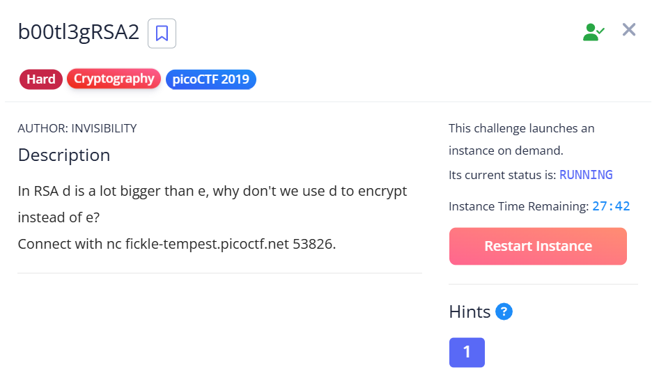

## b00tl3gRSA2



### Deepseek prompt

```
In RSA d is a lot bigger than e, why don't we use d to encrypt instead of e?

c: 88657206652880614057396700611964611096747365574209940841477380892112914062164675603478679434594258221702500947389859747337358144395252930200807146249938005937132410356363943656101834870820424603969020278726221160897220905969413819880377115229494944008478013763338877033515013338384258084358357544571589055202
n: 93289576736244640370229522756615345619476429237563357251347038935576590733156517397547060253952719676412640387695229680008940154062561599176715958158658673644185492277841540059975039924738885662228553255900523779239346287217748973737054155049761159507017765657167078566977127255327300434884955484393518019079
e: 66182546970031559414887032226773790061063782305739822269010318267096418962530770707868120595194741117767509989555548907370426835573565146285643709028925270580674965098161976310929784378296366124018041701074523702739613497332006205661147055833957503976453826072554395637894841099777585569031137238432394908513

ctf challenge, write a script to solve it
```

Flag: `picoCTF{bad_1d3a5_3801255}`